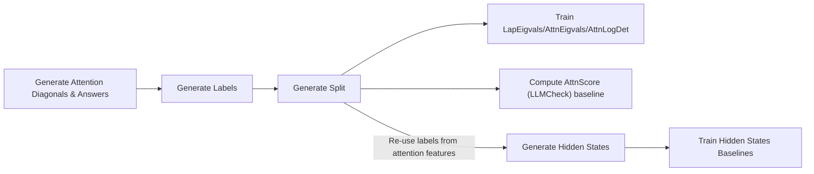

# Hallucination Detection in LLMs Using Spectral Features of Attention Maps


Official implementation of the paper ***Hallucination Detection in LLMs Using Spectral Features of Attention Maps***, accepted at EMNLP 2025 (see [how to cite our work](#citation)).

> [!IMPORTANT]
> If you have some questions regarding the code or the paper, please contact us at [jakub.binkowski@pwr.edu.pl](mailto:jakub.binkowski@pwr.edu.pl) or create an issue in the repository.

## Usage

### Prerequisites
- Python 3.12+
- [uv](https://docs.astral.sh/uv/) package manager

Install uv:

```bash
curl -LsSf https://astral.sh/uv/install.sh | sh
```

### Installation

**CPU (Linux/macOS):**

```bash
make install_cpu
```

**GPU (Linux with CUDA 12.4):**

```bash
make install_gpu
```

### Reproduce the experiments

The following flowchart describes the main steps to reproduce experiments. All steps can be run using DVC stages defined in `dvc.yaml`. In addition, `dvc.yaml` define more stages to compute results for ablation study. Below, we describe the main steps in more detail.



#### Datasets download

- `CoQA` - download devset from the official website: <https://nlp.stanford.edu/data/coqa/coqa-dev-v1.0.json>
- `GSM8K` - is available through huggingface hub, will be downloaded automatically.
- `HaluevalQA` - download data from the official repository: <https://github.com/RUCAIBox/HaluEval?tab=readme-ov-file#data-release>
- `NQOpen` - is available through huggingface hub, will be downloaded automatically.
- `SQuADv2` - download devset from the official website: <https://rajpurkar.github.io/SQuAD-explorer/dataset/dev-v2.0.json>
- `TriviaQA` - is available through huggingface hub, will be downloaded automatically.
- `TruthfulQA` - is available through huggingface hub, will be downloaded automatically.

#### Reproducing the results

1. Generate attention diagonals and answers:

  > [!NOTE]
  > For all LLMs and datasets, except for `mistral_small_24b_instruct_2501`, 40GB of VRAM is enough.

  > [!NOTE]
  > Separate stage is used for hidden states generation

  ```shell
  CUDA_VISIBLE_DEVICES=0 NUM_PROC=1 dvc repro generate_attentions_only
  ```

  ```shell
  CUDA_VISIBLE_DEVICES=0 NUM_PROC=1 dvc repro generate_hidden_states_for_selected_tokens
  ```

2. Evaluate generated answers

  ```shell
  dvc repro eval_answers_ngram
  ```

3. Evaluate generated answers using LLM-as-judge

  > [!NOTE]
  > Requires `OPENAI_API_KEY` to be present in .env file in the repository root dir, you can also configure `OPENAI_API_BASE_URL` to use different API endpoint

  ```shell
  dvc repro eval_answers_llm_judge
  ```

4. Generate labels

  > [!NOTE]
  > Separate stage is used for `GSM8K` dataset

  ```shell
  dvc repro generate_labels
  ```

  ```shell
  dvc repro generate_labels_gsm8k
  ```

5. Generate split

  ```shell
  dvc repro generate_split
  ```

6. Train probes

 > [!NOTE]
 > Separate stage is used for `AttnScore` baseline

 > [!NOTE]
 > Separate stage is used for hidden states baselines

  ```shell
  dvc repro train_attn_vs_laplacian_pca
  ```

  ```shell
  dvc repro train_hidden_states_baselines
  ```

  ```shell
  dvc repro probe_attn_score
  ```

## Citation

If you use this code in your research or find the work relevant, please consider citing our paper:

```bibtex
@inproceedings{binkowski2025hallucination,
  title={Hallucination Detection in {LLM}s Using Spectral Features of Attention Maps},
  author={Jakub Binkowski and Denis Janiak and Albert Sawczyn and Bogdan Gabrys and Tomasz Jan Kajdanowicz},
  booktitle={The 2025 Conference on Empirical Methods in Natural Language Processing},
  year={2025},
  url={https://openreview.net/forum?id=tm5JQTpBhj}
}
```
